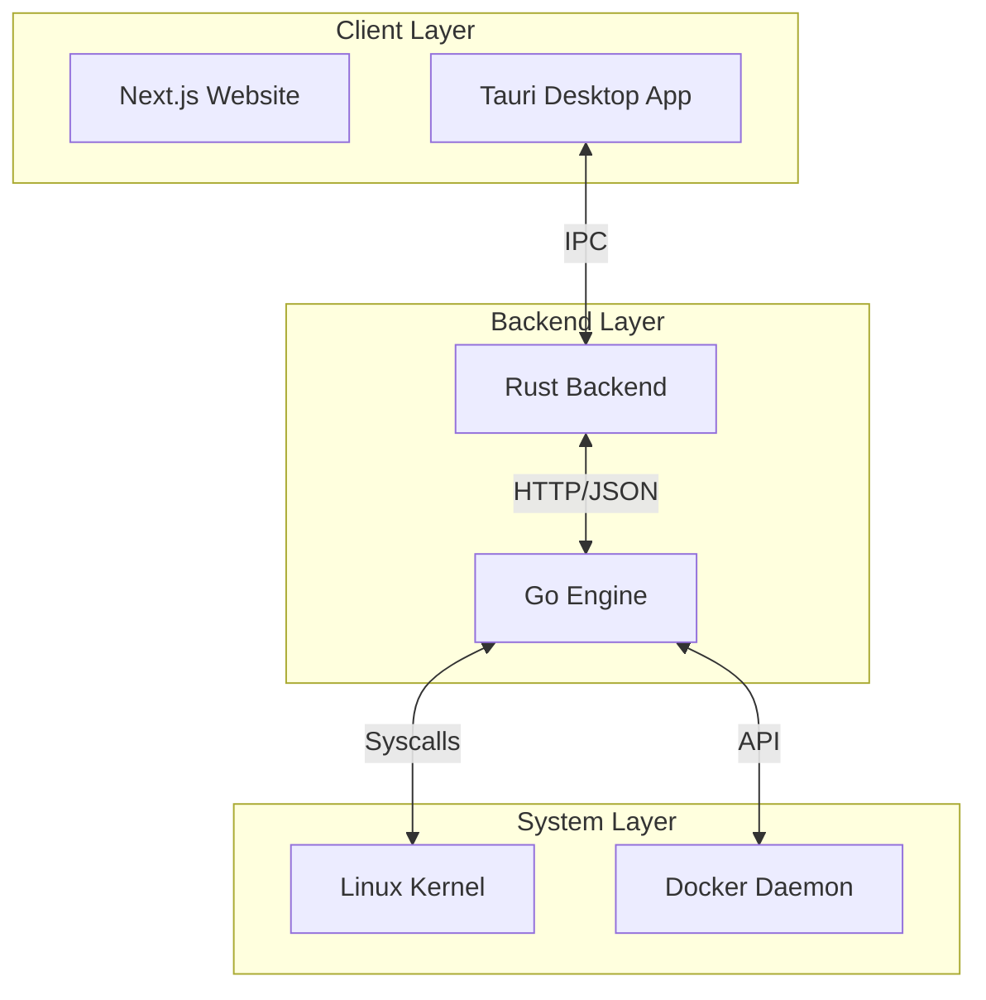

# 🟢 PortWatch

> **Deep shell observability for the modern engineer.**

PortWatch is a high-performance system monitoring and observability suite designed to give developers surgical precision over their local and containerized environments. It combines a low-overhead Go engine with a sleek Tauri-based desktop interface.

---

## 🏗️ System Architecture

PortWatch is built on a decoupled, modular architecture to ensure maximum performance and stability.



---

## 🚀 Key Features

- **Vector Filtering**: Heuristic filters purge 99% of background noise, exposing only relevant execution paths.
- **Docker Sentinel**: Deep-packet inspection maps container PIDs to host interfaces for unified monitoring.
- **Kill Logic v2**: Graceful termination with safety locks. Analyze dependencies before issuing a SIGKILL.
- **Ring 0 Awareness**: Low-level system calls for precise PID monitoring without the overhead of traditional tools.
- **Cyber-Green Tech Aesthetic**: Designed for the dark-mode generation with a premium, responsive UI.

---

## 📂 Project Structure

| Component   | Path        | Language/Tech          | Description                                                         |
| :---------- | :---------- | :--------------------- | :------------------------------------------------------------------ |
| **Engine**  | `./engine`  | `Go`                   | The core "brain" that monitors syscalls and network activity.       |
| **App**     | `./app`     | `Tauri` / `React`      | The cross-platform desktop agent with a sleek terminal-inspired UI. |
| **Website** | `./website` | `Next.js` / `Tailwind` | High-conversion landing page for distribution and documentation.    |

---

## 🛠️ Tech Stack

- **Core**: [Go](https://go.dev/) (System Observability), [Rust](https://www.rust-lang.org/) (Tauri Bridge)
- **Frontend**: [React](https://react.dev/), [Tauri](https://tauri.app/), [Next.js](https://nextjs.org/)
- **Styling**: Vanilla CSS, TailwindCSS (Website), Framer Motion
- **Observation**: [gopsutil](https://github.com/shirou/gopsutil)

---

## 📥 Getting Started

### Prerequisites

- Go 1.24+
- Rust & Cargo
- Bun (for frontend package management)
- Linux (for kernel-level monitoring features)

### Development Setup

1.  **Clone the Repository**

    ```bash
    git clone https://github.com/Blackrose-blackhat/run-state.git
    cd run-state
    ```

2.  **Run the Bootstrap Script**
    The `dev.sh` script automates the building of the Go engine and starts the Tauri development environment.

    ```bash
    chmod +x dev.sh
    ./dev.sh
    ```

3.  **Launch the Website**
    ```bash
    cd website
    bun install
    bun run dev
    ```

---

## 🛡️ Security

PortWatch uses localized HTTP communication for the bridge between the desktop app and the Go engine. All system-level interactions are restricted to the local loopback interface and Require internal authorization tokens (planned v1.1).

---

## 📄 License

Project by **Blackrose-blackhat**. For private/commercial use licensing, please contact the maintainers.

---

<p align="center">
  Built with ❤️ for the Engineering Community
</p>
